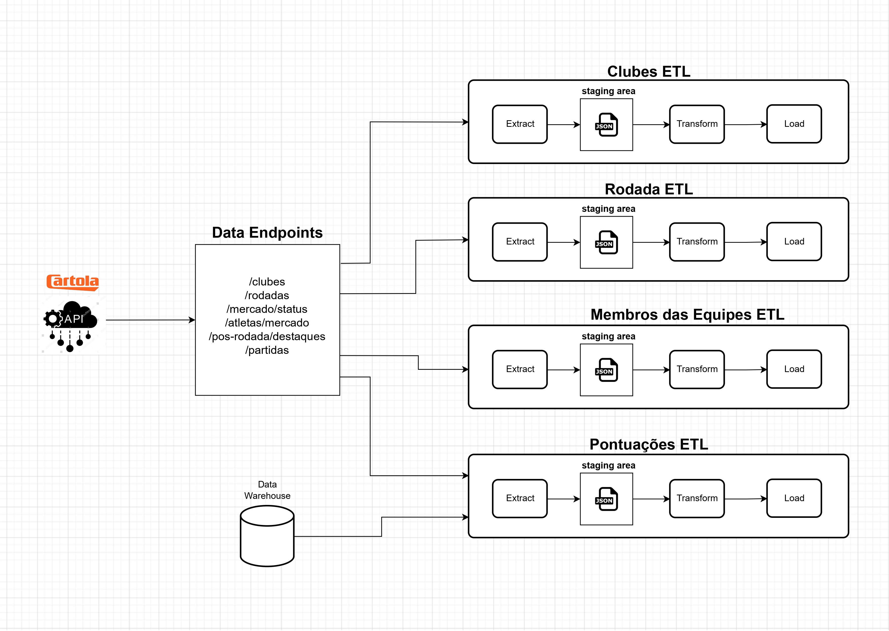

# Cartola ETL

Este é um projeto para extrair, transformar e carregar (ETL) dados da plataforma Cartola FC em um formato útil para análises.

## Table of Contents

- [Descrição](#descrição)
- [Fluxo de Dados](#fluxo-de-dados)
- [Modelo Dimensional](#modelo-dimensional)
- [Requisitos](#requisitos)
- [Instalação](#instalação)
- [Uso](#uso)
- [Licença](#licença)

## Descrição

O Cartola FC é uma plataforma popular de fantasy game de futebol no Brasil, onde os usuários podem montar seus times virtuais com jogadores da Série A do Campeonato Brasileiro e competir entre si. Este projeto tem como objetivo auxiliar os entusiastas do Cartola FC a realizar análises detalhadas dos dados disponíveis no jogo.

As principais funcionalidades do projeto incluem:
- Coleta de dados da API oficial do Cartola FC.
- Transformação dos dados brutos em um formato estruturado para análise.
- Armazenamento dos dados em um banco de dados.

## Fluxo de Dados

[](./docs/readme_assets/fluxo_de_dados.jpg)


### Data Source

A extração de dados é realizada a partir das seguintes APIs e do Data Warehouse:

* **APIs:**
    * Dados atualizados a cada rodada:
        * `https://api.cartolafc.globo.com/mercado/status`
        * `https://api.cartolafc.globo.com/atletas/mercado`
        * `https://api.cartolafc.globo.com/pos-rodada/destaques`
        * `https://api.cartolafc.globo.com/partidas`
    * Dados fixos:
        * `https://api.cartolafc.globo.com/clubes`
        * `https://api.cartolafc.globo.com/rodadas`
* **Data Warehouse:**
    * Tabela
      * `fact_pontuacoes`

### ETL

O processo ETL é dividido em quatro etapas:

1. **Extração:** Os dados são extraídos das APIs e do Data Warehouse.
4. **Staging Area:** Os dados das APIS são armazenados em formato JSON na Staging Area.
2. **Transformação:** Os dados são transformados para atender aos requisitos do modelo dimensional.
3. **Carregamento:** Os dados são carregados no Data Warehouse.


## Modelo Dimensional

[](./docs/readme_assets/modelo_dimensional.jpg)

**Tabela fato:**

* **fact_pontuacoes:** Armazena os dados de pontuação dos atletas, que são os dados de interesse do projeto.

**Tabelas dimensão:**

* **dim_rodada:** Armazena informações contextuais sobre as rodadas, como data e número de times escalados.
* **dim_membro_equipe:** Armazena informações contextuais sobre os atletas, como nome e posição.
* **dim_clube:** Armazena informações contextuais sobre os clubes, como nome e abreviação.

**Relações entre as tabelas:**

* **fact_pontuacoes:** Relaciona-se com **dim_rodada** por meio da coluna **rodada_id**.
* **fact_pontuacoes:** Relaciona-se com **dim_clube** por meio da coluna **clube_id**.
* **fact_pontuacoes:** Relaciona-se com **dim_membro_equipe** por meio da coluna **membro_equipe_id**.


## Requisitos

Antes de começar, certifique-se de que você tenha os seguintes requisitos instalados:

- Python >=3.8.10
- Banco de Dados MySQL

## Instalação

1. Clone este repositório:

   ```bash
   git clone https://github.com/DanielSalesS/cartola_etl.git
   cd cartola_etl
   ```


2. Ambiente Virtual (opcional, mas recomendado):

   É altamente recomendado criar um ambiente virtual para isolar as dependências do projeto. Você pode criar um ambiente virtual usando o módulo `venv` ou `virtualenv`. Por exemplo:

      ```
      python -m venv myenv
      source myenv/bin/activate
      ```


3. Instale o projeto em modo editável usando o `pip`:

   ```bash
   pip install -e .
   ```

## Uso

1. Defina as variáveis de ambiente no arquivo `.env`.

2. Execute o script de configuração inicial:
   ```bash
   python easy_config.py
   ```

3. Execute a pipeline para transformar e carregar os dados das rodadas anteriores:
   ```bash
   python stored_rounds_etl_pipeline.py
   ```

Após a conclusão desses passos, os dados das rodadas anteriores estarão inseridos no banco de dados. Isso permitirá o acesso aos dados para análise exploratória, criação de dashboards e implementação de modelos de machine learning.

Certifique-se de executar a cada rodada a pipeline `round_etl_pipeline.py` para manter os dados do banco de dados atualizados. Caso perca alguma rodada, é possível sincronizar os dados da `staging_area` com este repositório. Isso garantirá que as informações mais recentes estejam sempre disponíveis para uso.

## Licença

Este projeto está licenciado sob a Licença MIT. Consulte o arquivo [LICENSE](LICENSE) para obter mais detalhes.